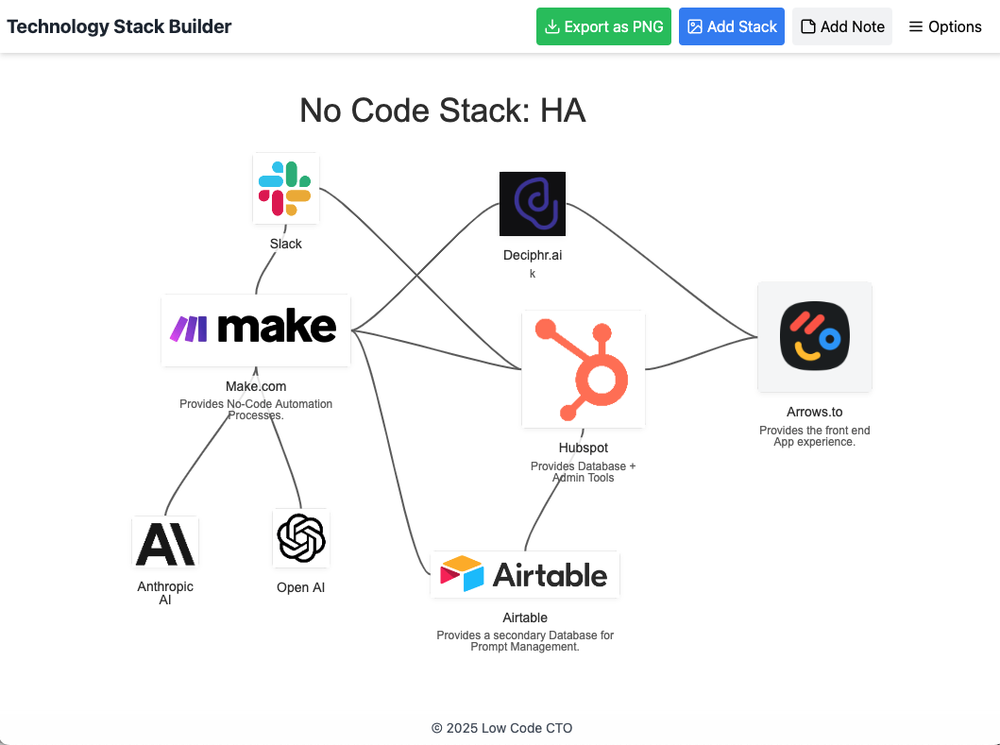

# Low Code Stack Builder
This is part of my no-code-feb, where I try to build applications
of increasing complexity to find the outer limit of what AI can do
to replace my code-first inner developer.

- __When__: Week 3 Feb 2025
- __Timelimit__: 1.5hr
- __Tokens__: 1.1m
- __Ai Builder__: [Bolt.new](https://bolt.new)
- __Quality__: Good for Internal use. Not production ready.
- __Demo__: [Demo Site](https://apps.stack.lowcodecto.com/)
- __Mission__: Build on Bolt.new, tweak in code on Github.

# Goal
The goal of this little app is to help me build a social preview
image that will be embedded in a blog article and will inflate 
and be visible during social media sharing; SMS Text, Slack, and
any other media that uses HTML meta tags.

- One page application.
- Built in React.js
- Add one or more images.
- Set the title and subtitle font, color and offsets.
- Add drop shadow to the images
- Exports to a PNG file.
- Local storage for the icons defaults and settings.
- Uses Redux for state management.
- Uses Netlify for hosting.

Screenshot of the stack builder.

## Pain Points
- Spacing between icons changes in prompt requests.
- Icon offset needed code to make it align.
- Use of modal needed more prompts then expected.
- Too many controls make it hard to get the prompts right.

## Subscribe to learn more...
I am a fractional CTO, and recovering startup founder. I use
No-Code and Low-Code tools and patterns to built revenue generating
applications, without the need to code.

[Subscribe to my newsletter](https://lowCodeCTO.com)

## Local Development
Reminder commands for myself for local tweaks.

- `npm run dev`
- `npm run build`
- `netlify deploy` or `netlify deploy --prod`
